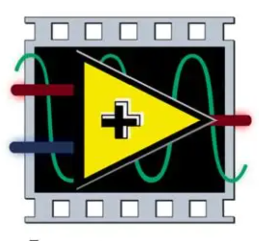

  <h1> ⚡Scott Torzewski⚡</h1>

  
  

 

  

---

## :man_technologist: About Me :

Welcome to my GitHub Profile! 👋
I’m Scott Torzewski, an electrical and computer engineer with a passion for biomedical systems, hardware design, and data-driven analysis.

- 🖥️ I recently graduated from Lafayette College with a Bachelor of Science in Electrical & Computer Engineering and a minor in Mathematics.
- 🧬 I’m passionate about applying the engineering design process to enhance human health and well-being through signal acquisition, physiological modeling, and embedded systems development.
- ✍️ I love sharing knowledge, collaborating across disciplines, and exploring the intersection of electronics, computation, and biology.
- 🎹 Outside the lab, I build 3D designs, solder electronics, play the piano, and snowboard.

<!---
ScottTorzewski/ScottTorzewski is a ✨ special ✨ repository because its `README.md` (this file) appears on your GitHub profile.
You can click the Preview link to take a look at your changes.
--->

---

## 🛠️ Portfolio:
*️❗ Please see the README file in each repository for a motivation and general summary of all works. ❗️⃣

### 🔹 **[Electrical and Computer Engineering](https://github.com/ScottTorzewski/Electrical-and-Computer-Engineering)**  

### 🔹 **[Biomedical Engineering](https://github.com/ScottTorzewski/Biomedical-Engineering)**  

### 🔹 **[ML/Data Analysis](https://github.com/ScottTorzewski/ML-Data-Analysis)**  

---
## :hammer_and_wrench: Languages and Tools :

  &nbsp;
  &nbsp;
  &nbsp;
  

---

  ## 📫 Get in Touch  
📩 **Email**: torzewskis@gmail.com    

