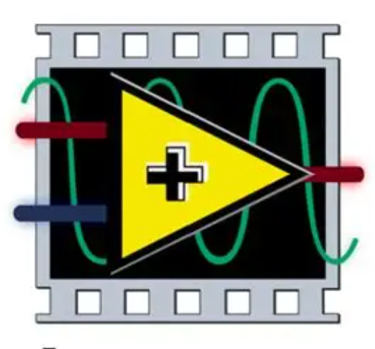

  <h1> ⚡Scott Torzewski⚡</h1>

  

 

  

---

## :man_technologist: About Me :

Welcome to my GitHub Profile! 👋
I’m Scott Torzewski, an electrical engineer focused on hardware and integrated circuit design. I’m currently pursuing an M.S. in Electrical Engineering at Columbia University, with a focus on Integrated Circuits & Systems, after earning a B.S. in Electrical and Computer Engineering with a Mathematics Minor from Lafayette College.

- 🔬 I’m focused on designing and prototyping electronic systems spanning analog, mixed-signal, digital, and embedded hardware.
- 🧬 My interests center on integrated circuits, sensing systems, and the intersection of electronics, photonics, and biotechnology.
- 💿 I enjoy tackling interdisciplinary engineering challenges, translating concepts into working hardware, and exploring how advanced electronics can enable new sensing and instrumentation technologies.
- 💡 Outside the lab, I build 3D designs, solder electronics, play the piano, and snowboard.

<!---
ScottTorzewski/ScottTorzewski is a ✨ special ✨ repository because its `README.md` (this file) appears on your GitHub profile.
You can click the Preview link to take a look at your changes.
--->

---

## 🛠️ Portfolio:
*️⃣ Please see the README file in each repository for a motivation and general summary of all works. *️⃣

### 🔹 **[Electrical and Computer Engineering](https://github.com/ScottTorzewski/Electrical-and-Computer-Engineering)**  

### 🔹 **[Biomedical Engineering](https://github.com/ScottTorzewski/Biomedical-Engineering)**  

### 🔹 **[Computational Methods for Data Analysis](https://github.com/ScottTorzewski/Computational-Methods-for-Data-Analysis)**  

---
## :hammer_and_wrench: Languages and Tools :

  
  
  
  &nbsp;
  &nbsp;
  &nbsp;
  

---

  ## 📫 Get in Touch  
📩 **Email**: torzewskis@gmail.com    

